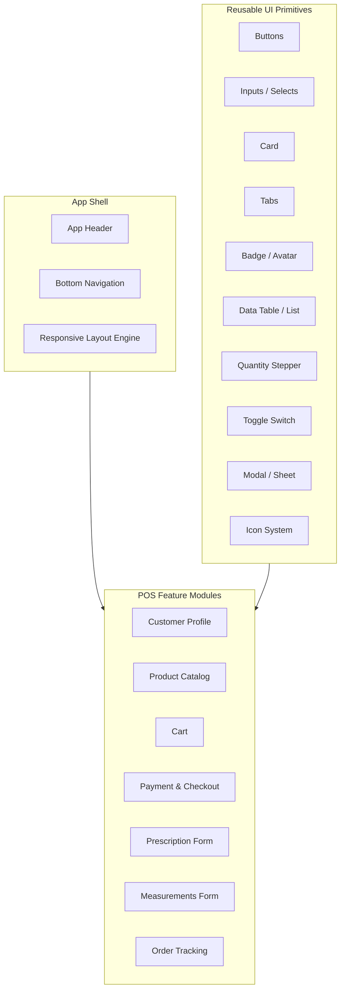

# POS dashboard — UI component architecture

Component inventory for the Eyewa POS reference screen (`raw-knowledge/files/POSScreen.png`), targeting iOS and Android via Capacitor.

## Component architecture overview



## 1. Foundation layer

Build once, use everywhere. Not Angular components, but required before screen work.

| Item | Purpose |
|------|---------|
| **Design tokens** (`styles.css`) | Colors, radii, spacing, shadows, typography — extend the login token set |
| **Typography scale** | Headings, body, captions, price labels, tab labels |
| **Icon set** | Inline SVG icons (search, bell, barcode, filter, trash, print, nav icons) |
| **Safe-area utilities** | `env(safe-area-inset-*)` for iOS notch/home indicator |
| **Touch targets** | Min 44×44px tap areas; input font-size ≥ 16px on iOS |
| **Currency / number pipes** | SAR formatting, VAT calculation display |

## 2. Reusable UI primitives (`shared/ui/`)

Building blocks reused across every card and form.

### Inputs & forms

| Component | Variants / notes |
|-----------|------------------|
| `TextInput` | With optional left icon (search, barcode) |
| `NumericInput` | SPH, CYL, AXIS, PD — constrained ranges, step values |
| `SearchInput` | Debounced, clear button, placeholder variants |
| `Select` / `Dropdown` | Payment method, lens type, filters |
| `ToggleSwitch` | "Redeem Loyalty Points" |
| `Checkbox` | Multi-select filters |
| `FormField` | Label + input + error message wrapper |
| `FormGrid` | 2-column OD/OS prescription layout |

### Actions

| Component | Variants |
|-----------|----------|
| `Button` | Primary (filled blue), Secondary (outlined), Ghost, Danger |
| `IconButton` | Trash, filter, barcode scan, +/- quantity |
| `LinkButton` | "View History", "Redeem Points" |

### Display

| Component | Variants |
|-----------|----------|
| `Card` | Container with title bar + body + optional footer |
| `Avatar` | Initials circle, optional image |
| `Badge` | Notification count, loyalty points, order status |
| `Chip` / `Tag` | Product category, payment method selected state |
| `PriceLabel` | Formatted currency, strikethrough for discounts |
| `EmptyState` | "No customer selected", "Cart is empty" |
| `Divider` | Horizontal rule between payment sections |
| `SkeletonLoader` | Product grid, customer card while loading |

### Navigation & layout

| Component | Variants |
|-----------|----------|
| `Tabs` | Horizontal — Frames / Lenses / Accessories / Contact Lens |
| `TabBar` | Bottom nav — Sell, Prescription, Measurements, Delivery, More |
| `PaginationDots` | Product carousel indicator |
| `ScrollContainer` | Horizontal product scroll, vertical cart list |

### Data display

| Component | Variants |
|-----------|----------|
| `DataTable` / `ListRow` | Cart line items (name, qty, price, actions) |
| `QuantityStepper` | +/- with min 1, max stock |
| `ProgressStepper` | Order stages (Placed → Lens Ordered → Ready → Delivered) |
| `SummaryRow` | Key-value row (Subtotal, VAT, Total) |

### Overlays

| Component | Use |
|-----------|-----|
| `Modal` | New Customer, View History |
| `BottomSheet` | Mobile-friendly filters, payment method picker |
| `Toast` / `Snackbar` | "Item added", "Payment failed" |
| `ConfirmDialog` | Clear cart, remove item |

### Specialized optical

| Component | Use |
|-----------|-----|
| `EyeDiagram` | OD/OS schematic for prescription entry |
| `FaceMeasurementDiagram` | Bridge width, temple length visual reference |
| `PrescriptionGrid` | Reusable OD/OS × SPH/CYL/AXIS/ADD/PD matrix |

## 3. Composite feature modules (screen sections)

Each maps to a card or region in the POS reference screen.

### `AppHeaderComponent`

- Global customer search (`SearchInput`)
- `+ New Customer` button → opens `NewCustomerModal`
- Loyalty points badge
- Notification bell with `Badge`
- User profile dropdown (avatar, name, branch)

Detailed spec (tablet + mobile): [`specs/002-common-components/spec.md`](../../specs/002-common-components/spec.md) — see [`components/app-header/spec.md`](../../specs/002-common-components/components/app-header/spec.md)

### `CustomerProfileCardComponent`

Detailed spec: [`specs/005-sell-dashboard/components/customer-profile-card/spec.md`](../../specs/005-sell-dashboard/components/customer-profile-card/spec.md) — index: [`specs/005-sell-dashboard/spec.md`](../../specs/005-sell-dashboard/spec.md)

- `Avatar` + name, ID, phone
- Loyalty points widget + "Redeem Points" action
- "View History" link → history modal/sheet

### `ProductCatalogCardComponent`

- `Tabs` (Frames, Lenses, Accessories, Contact Lens)
- Search + barcode scan + filter actions
- `ProductGridComponent` → list of `ProductCardComponent`
- `PaginationDots` for carousel pages

### `ProductCardComponent`

- Product image, brand, model ID, price
- Tap → add to cart

### `CartCardComponent`

- `CartLineItemComponent` (product name, variant, price, `QuantityStepper`, delete)
- "Clear Cart" footer action
- Empty state when no items

### `PaymentCheckoutCardComponent`

- `SummaryRow` list (Subtotal, Discount input, VAT, Total)
- `ToggleSwitch` for loyalty redemption
- `PaymentMethodSelectorComponent` (Cash, Card, Mixed, More — icon chips)
- `PayAndPrintButton` (primary CTA, loading/disabled states)

### `PrescriptionFormCardComponent`

- `PrescriptionGrid` for OD/OS
- Numeric fields: SPH, CYL, AXIS, ADD, PD, Near PD, VD, Notes
- Actions: Save Prescription, Print, Cancel
- Optional `EyeDiagram` reference

Detailed spec: [`specs/003-prescription-create/spec.md`](../../specs/003-prescription-create/spec.md)

### `MeasurementsFormCardComponent`

- Numeric inputs: PD, Near PD, Frame Width, Bridge Width, Temple Length, Lens Height, Wrap Angle, Frame Height
- Face Form select; Save Measurements + Edit
- `FaceMeasurementDiagram` schematic

Detailed spec: [`specs/004-measurements-create/spec.md`](../../specs/004-measurements-create/spec.md)

### `OrderTrackingCardComponent`

- `ProgressStepper` with 4 stages
- Current stage highlight + optional timestamps

### `BottomNavigationComponent`

- 5 tabs with icon + label
- Active state for current section (Sell highlighted in reference)

Detailed spec: [`specs/002-common-components/components/bottom-nav/spec.md`](../../specs/002-common-components/components/bottom-nav/spec.md)

## 4. App shell & layout

| Component | Responsibility |
|-----------|----------------|
| `PosShellComponent` | Header + main content area + bottom nav |
| `PosDashboardLayoutComponent` | CSS Grid for tablet (multi-card); stacks or tabs on phone |
| `ResponsiveBreakpointService` | Detect phone vs tablet; switch layout mode |

### Responsive strategy

| Breakpoint | Layout |
|------------|--------|
| **Tablet (≥768px)** | Multi-column grid as in the reference (customer + catalog + cart + payment side by side) |
| **Phone (<768px)** | Bottom nav drives full-screen sections; Sell tab shows customer → catalog → cart → payment as a vertical flow or sub-tabs |

## 5. Supporting services & state

| Service | Role |
|---------|------|
| `CustomerService` | Search, create, load profile, loyalty balance |
| `ProductService` | Catalog by category, barcode lookup, filters |
| `CartService` | Add/remove/update qty, subtotal, clear |
| `PrescriptionService` | OD/OS values, validation rules |
| `MeasurementService` | Fitting measurements per order |
| `OrderService` | Order status, stage transitions |
| `PaymentService` | Totals, discount, VAT, loyalty redemption, payment method |
| `AuthService` | Staff session, branch context (see `specs/001-staff-login/`) |
| `NotificationService` | In-app alerts badge |
| `PrintService` | Receipt generation after pay |
| `BarcodeScannerService` | Camera / hardware scanner integration |
| `AppConfigService` | API URL, VAT rate, currency |

### State management

A single `PosSessionStore` (signals or a lightweight store) should hold:

- Selected customer
- Active cart
- Prescription + measurements for current order
- Payment draft (discount, loyalty toggle, method)

This keeps cards in sync without tight coupling.

## 6. Capacitor / platform plugins (iOS & Android)

| Plugin / capability | Used by |
|---------------------|---------|
| `@capacitor/camera` or barcode plugin | Product scan |
| `@capacitor/haptics` | Tap feedback on pay, add to cart |
| `@capacitor/status-bar` | Match header color on native |
| `@capacitor/keyboard` | Adjust layout when keyboard opens (prescription forms) |
| `@capacitor/app` | Back button handling on Android |
| Bluetooth / network print plugin (TBD) | Pay & Print |
| Safe area / splash | Native shell polish |

## 7. Suggested folder structure

Aligned with the staff-login feature pattern:

```
src/app/
├── shared/
│   ├── ui/           # All primitives (button, input, card, tabs, ...)
│   ├── pipes/        # currency, phone format
│   └── directives/   # autofocus, numeric-only
├── features/
│   ├── auth/         # login
│   └── pos/
│       ├── shell/    # header, bottom-nav, layout
│       ├── customer/
│       ├── catalog/
│       ├── cart/
│       ├── payment/
│       ├── prescription/
│       ├── measurements/
│       └── order-tracking/
├── services/         # cart, product, customer, print, barcode
└── models/           # Customer, Product, CartItem, Prescription, Order
```

## 8. Recommended build order

| Phase | Components |
|-------|------------|
| **1 — Design system** | Tokens, Button, Input, Card, Icon, Avatar, Badge |
| **2 — Shell** | PosShell, Header, BottomNav, responsive layout |
| **3 — Sell flow (MVP)** | Customer search/profile, Product catalog + card, Cart, Payment summary — [`specs/005-sell-dashboard/spec.md`](../../specs/005-sell-dashboard/spec.md) |
| **4 — Optical forms** | Prescription grid, Measurements + diagrams |
| **5 — Order tracking** | Progress stepper, status API |
| **6 — Native** | Barcode, print, haptics, safe areas |

## Summary counts

| Category | Approx. count |
|----------|---------------|
| Reusable UI primitives | 25–30 |
| Feature/composite components | 12–15 |
| Shell/layout | 3–4 |
| Services | 10–12 |
| Capacitor integrations | 4–6 |

## Related artifacts

- **Shell components index:** [`specs/002-common-components/spec.md`](../../specs/002-common-components/spec.md)
- **Component specs:** [`app-header`](../../specs/002-common-components/components/app-header/spec.md) · [`profile-page`](../../specs/002-common-components/components/profile-page/spec.md) · [`bottom-nav`](../../specs/002-common-components/components/bottom-nav/spec.md) · [`pos-shell`](../../specs/002-common-components/components/pos-shell/spec.md)
- **Sell dashboard index:** [`specs/005-sell-dashboard/spec.md`](../../specs/005-sell-dashboard/spec.md)
- **Sell components:** [customer-profile-card](../../specs/005-sell-dashboard/components/customer-profile-card/spec.md) · [latest-prescription-summary](../../specs/005-sell-dashboard/components/latest-prescription-summary/spec.md) · [product-catalog-card](../../specs/005-sell-dashboard/components/product-catalog-card/spec.md) · [cart-card](../../specs/005-sell-dashboard/components/cart-card/spec.md) · [payment-card](../../specs/005-sell-dashboard/components/payment-card/spec.md) · [services](../../specs/005-sell-dashboard/services/spec.md)
- Visual reference: [`raw-knowledge/files/POSScreen.png`](../../raw-knowledge/files/POSScreen.png)
- Auth prerequisite: [`specs/001-staff-login/`](../../specs/001-staff-login/)
- Implementation target: `optical-pos-angular-capacitor-ux/`
