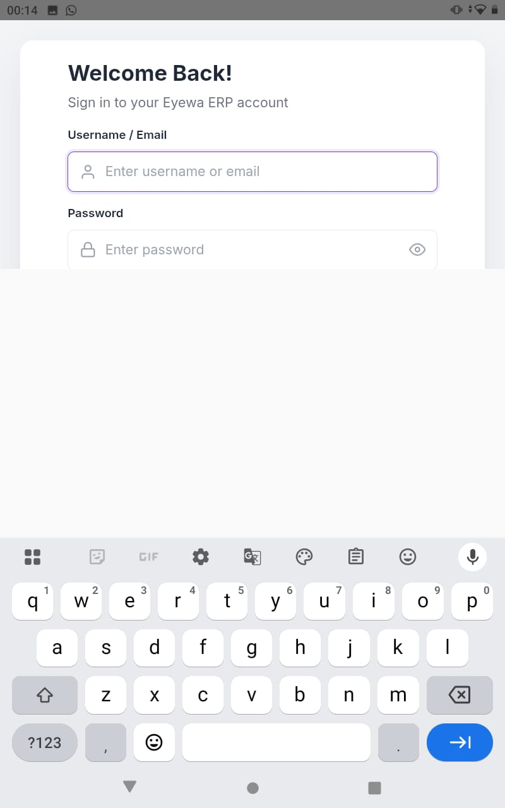
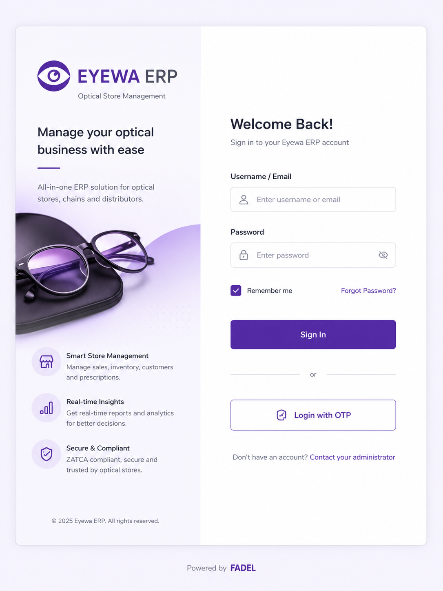

# Feature: Staff login

## Summary

Provide a sign-in screen for optical store staff to access the ERP/POS. The UI matches **`EyewaLogin.png` in full** — split card with **left branding panel** and **right login form**, centered on a light grey page with **“Powered by FADEL”** watermark below. **Primary target: tablet.** Supports password login and OTP as an alternative.

## Implementation status

| Phase | Scope | Status |
|-------|--------|--------|
| **1 — UI shell** | Layout, tokens, form, validation, password toggle | **Done** |
| **2 — Navigation** | Forgot password, OTP, contact admin route stubs | **Done** |
| **3 — Auth API integration** | Eyewa `VerifyUserLogin`, JWT session, `FillStore`, auth guard | **Done** |
| **3b — Token & persistence** | Cookie tokens, `Authorization` header, refresh token, stay logged in until sign out | **Done** |
| **4 — OTP & recovery** | OTP send/verify, password reset flows | Planned |
| **3c — Tablet keyboard layout** | Compact scrollable layout when IME open; Android `adjustResize`; global `KeyboardViewportService` | **Done** |

**Current state:** **Sign In** calls the Eyewa demo API by default (`useMockAuth: false`). Flow: `LoginComponent.onSubmit()` → `AuthService.login()` → `LoginService.verifyUserLogin()` → `GET {apiUrl}/{authLoginPath}?LoginName=…&Password=…`. On success, JWT **access** and **refresh** tokens are stored in cookies; session JSON is persisted in **`localStorage`** until manual **Sign out**. All API calls send `Authorization: Bearer {token}` via `authInterceptor`. Expired tokens are refreshed via `POST auth/RefreshToken` (on app launch and on HTTP 401). `AuthService` loads stores from `FillStore`, then routes to `/home`. Mock auth remains when `useMockAuth: true` (`staff@eyewa.com` / `demo1234`).

**Demo API credentials:** `LoginName=Canada`, `Password=a1b2c3d4` — [VerifyUserLogin](https://demo.api.eyewacloud.com/api/auth/VerifyUserLogin?LoginName=Canada&Password=a1b2c3d4). After login, header shows **Canada** and store **Naimat Al Basar** (from [FillStore](https://demo.api.eyewacloud.com/api/stores/FillStore?LoginId=1&StoreId=0)).

## Layout decision

| In scope | Out of scope |
|----------|--------------|
| **Full split login card** per `EyewaLogin.png` | Self-service registration |
| Left branding panel (logo, headline, hero, features, copyright) | Social login |
| Right login form panel (welcome, fields, actions, footer) | Multi-tenant store picker on login |

**Primary target:** tablet (iPad / Android tablet). On phone, show **form panel only**; branding panel hidden when phone breakpoint rules apply (see [`002-common-components`](../002-common-components/spec.md#responsive-breakpoints-canonical)).

### Page structure

```
┌─────────────────────────────────────────────────────────────┐  light grey page bg
│  ┌──────────────────────────┬─────────────────────────────┐ │
│  │ LEFT — branding (~45%)   │ RIGHT — login form (~55%)   │ │  white rounded card
│  │ EYEWA ERP logo           │ Welcome Back!                 │ │
│  │ headline + purple line   │ fields, Sign In, OTP          │ │
│  │ hero (glasses gradient)  │ footer link                   │ │
│  │ 3 feature bullets        │                               │ │
│  │ © 2025 Eyewa ERP         │                               │ │
│  └──────────────────────────┴─────────────────────────────┘ │
│                    Powered by FADEL                           │
└─────────────────────────────────────────────────────────────┘
```

### Left branding panel (tablet)

| Element | Copy / style |
|---------|----------------|
| Logo | Purple eye icon + **EYEWA ERP** + “Optical Store Management” |
| Headline | **Manage your optical business with ease** |
| Accent | Short purple horizontal line under headline |
| Description | All-in-one ERP solution for optical stores, chains and distributors. |
| Hero | Decorative purple gradient with glasses illustration |
| Features | Smart Store Management; Real-time Insights; Secure & Compliant (with purple icon circles) |
| Copyright | © 2025 Eyewa ERP. All rights reserved. |
| Background | Light grey panel (`#f8fafc`) inside white card |

### Right form panel

Implementation must match the **right-hand form panel** in `EyewaLogin.png` for color, typography, spacing, icons, and control states.

## Visual design (must match reference)

Implementation must be visually indistinguishable from **`EyewaLogin.png`** (full card). When in doubt, match the reference screenshot—not generic Material or Bootstrap defaults.

### Color palette

| Token | Usage | Reference appearance |
|-------|--------|----------------------|
| **Primary purple** | Sign In button fill, Forgot Password link, Remember me checked state, OTP button border/text, administrator link | Vibrant medium-dark purple (solid fill on primary CTA) |
| **White** | Page background, input backgrounds, OTP button fill | Pure white |
| **Heading text** | “Welcome Back!” | Dark grey, bold |
| **Body / subtext** | Subtitle, field labels, footer helper text | Medium grey |
| **Placeholder text** | Input placeholders | Light–medium grey |
| **Input border** | Text field outlines | Light grey, subtle |
| **Divider** | “or” separator line | Thin light grey line; “or” in muted grey |
| **Primary button text** | Sign In label | White on purple |

> Exact hex values should be sampled from the reference image or taken from Eyewa/Fadel brand tokens when published. Do not substitute a different purple or grey scale.

### Typography

- **Font family:** Clean modern sans-serif (Inter or equivalent)—same weight and size hierarchy as reference
- **Welcome heading:** Large, bold, dark grey — `Welcome Back!`
- **Subtitle:** Smaller regular weight — `Sign in to your Eyewa ERP account`
- **Field labels:** Medium weight, dark grey — `Username / Email`, `Password`
- **Button labels:** Medium weight; primary white on purple; secondary purple on white
- **Footer / helper:** Small, grey body text with purple link emphasis

### Form fields

- White background, light grey border, **rounded corners (~6–8px)**
- **Left icon** inside field: user icon (username), lock icon (password)
- Placeholders: `Enter username or email`, `Enter password`
- Password field: **eye / eye-slash toggle** on the right inside the field
- Consistent vertical spacing between label and input, and between field groups

### Controls

| Control | Style |
|---------|--------|
| **Remember me** | Checkbox left-aligned; checked state uses **purple fill** with white checkmark |
| **Forgot Password?** | Right-aligned on same row as Remember me; **purple text link**, no underline by default |
| **Sign In** | Full-width; **solid purple** background; white text; rounded corners; comfortable height |
| **Divider** | Horizontal rule with centered **“or”** in muted grey |
| **Login with OTP** | Full-width **outlined** button: white fill, **purple border**, purple text; shield/mobile icon left of label |
| **Contact administrator** | Footer: grey sentence; **“Contact your administrator”** as purple link |

### Layout and spacing

- Page background: **light grey**; centered **white rounded card** with subtle shadow (~1080px max width on tablet)
- Split: **~45% branding / ~55% form** on tablet (`(min-width: 768px)` or `(min-width: 600px) and (min-height: 700px)`)
- Form content vertically centered in right panel; max-width ~440px
- Watermark **below card**: “Powered by **FADEL**” — grey text, **FADEL** in purple bold
- Touch-friendly tap targets (min ~44px height on buttons and inputs)

### Compact layout (keyboard / short viewport)

When the on-screen keyboard is open or the visible viewport is short, the login page must **not** keep the tall centered tablet card — that pushes **Sign In** and actions off-screen (see issue reference below).

**App-wide:** `KeyboardViewportService` (initialized in `app.config.ts`) syncs `--app-height` from `window.visualViewport` on every screen and toggles `html.keyboard-open` when the keyboard inset exceeds 120px. Global rules in `styles.css` apply to the POS shell, sell dashboard, create customer, prescription, measurements, and login. See also [`002-common-components`](../002-common-components/spec.md) bottom-nav keyboard behavior.

**Login-specific triggers (either is enough):**

| Trigger | Mechanism |
|---------|-----------|
| **Keyboard open** | `KeyboardViewportService` → `html.keyboard-open` + `--app-height` from `visualViewport` |
| **Short viewport** | CSS `@media (max-height: 700px)` — covers resized WebView after keyboard, landscape phones, etc. |

**Compact behavior:**

| Element | Default (tablet) | Compact |
|---------|------------------|---------|
| Page | `justify-content: center`; full viewport height | `justify-content: flex-start`; `overflow-y: auto`; scroll padding for safe areas |
| Card | `min-height: min(640px, calc(100dvh - 6rem))` | `min-height: auto` |
| Branding panel | Visible on tablet | **Hidden** (form uses full card width) |
| Form panel | Vertically centered (`align-items: center`) | Top-aligned (`align-items: flex-start`) |
| Focused input | — | `scrollIntoView({ block: 'center' })` after 300ms (keyboard animation) |

**Native (Android):** `MainActivity` uses `android:windowSoftInputMode="adjustResize|stateHidden"` and `WindowCompat.setDecorFitsSystemWindows(getWindow(), true)`.

**Android 9–10 WebView quirk:** `visualViewport` and CSS `100vh`/`100dvh` often **do not** shrink when the IME opens. The app uses `window.innerHeight` (via `KeyboardViewportService` + inline bootstrap in `index.html`) and sets `--app-height` in pixels. `html.android-webview` avoids viewport-unit page height.

**Issue reference:** 

### Brand watermark

- **“Powered by Fadel”** small muted text at bottom center of screen (as shown in reference)

### Copy (exact strings from reference)

| Element | Text |
|---------|------|
| Heading | Welcome Back! |
| Subtitle | Sign in to your Eyewa ERP account |
| Username label | Username / Email |
| Username placeholder | Enter username or email |
| Password label | Password |
| Password placeholder | Enter password |
| Checkbox | Remember me |
| Link | Forgot Password? |
| Primary button | Sign In |
| Divider | or |
| Secondary button | Login with OTP |
| Footer | Don't have an account? Contact your administrator |
| Watermark | Powered by FADEL |

## Reference



## Problem

Store staff need a fast, trustworthy way to open the system at the start of a shift on a **store tablet**. Authentication must feel professional and match the Eyewa brand experience shown in the reference.

## User stories

### Story 1 — Sign in with username or email

**As a** store staff member  
**I want** to sign in with my username or email and password  
**So that** I can access the POS and store tools for my shift

**Acceptance criteria**

- [x] Login page shows a welcome message (“Welcome Back!”) and subtitle (“Sign in to your Eyewa ERP account”) with reference typography and colors
- [x] User can enter username or email in a dedicated field with a user icon (left), light grey border, white background, rounded corners
- [x] User can enter password in a masked field with a lock icon (left) and matching field styling
- [x] User can toggle password visibility (eye / eye-slash icon on the right) without clearing the field
- [x] Primary **Sign In** button: full-width, solid purple, white text—matches reference
- [x] Primary **Sign In** submits credentials to Eyewa `VerifyUserLogin` API (or mock when `useMockAuth: true`) and routes to `/home` on success
- [x] Invalid credentials show a clear, non-leaking error (no hint whether username or password failed)
- [x] Empty required fields are validated before submit

### Story 2 — Stay signed in on trusted devices

**As a** regular staff member on a store terminal  
**I want** to use “Remember me”  
**So that** I don’t have to re-enter credentials on every visit on that device

**Acceptance criteria**

- [x] “Remember me” checkbox is available on the login form (default unchecked for shared terminals)
- [x] Checkbox uses reference styling: purple fill with white checkmark when checked
- [x] “Remember me” and “Forgot Password?” sit on one row (checkbox left, link right)—same as reference
- [x] When checked, session persists in `localStorage`; when unchecked, `sessionStorage` (key: `eyewa_auth_session`)
- [ ] Session duration / idle timeout policy (config keys `idle`, `timeout` in appsettings — not yet enforced on login)
- [ ] Remember-me does not bypass re-auth for sensitive actions if policy requires it

### Story 3 — Recover forgotten password

**As a** staff member who forgot my password  
**I want** a “Forgot Password?” path  
**So that** I can regain access without calling support for every reset

**Acceptance criteria**

- [x] “Forgot Password?” link is visible on the login form, **purple text**, right-aligned opposite Remember me
- [ ] Link opens password recovery flow (email/username verification per policy) — route stub only (`/forgot-password`)
- [x] User can return to login from recovery flow
- [ ] Recovery flow does not reveal whether an account exists

### Story 4 — Sign in with OTP

**As a** staff member who prefers or is required to use OTP  
**I want** to log in with a one-time password  
**So that** I can authenticate without typing my permanent password on shared or mobile devices

**Acceptance criteria**

- [ ] “Login with OTP” shown below Sign In, separated by thin divider with centered **“or”**—matches reference
- [ ] OTP button: full-width outlined style (white fill, purple border, purple text, icon left of label)
- [ ] OTP flow collects identifier (phone/email per policy), sends code, and verifies it
- [ ] OTP expires after a defined window; user can request resend with rate limiting
- [ ] Successful OTP login lands on the same post-auth destination as password login

### Story 5 — Provisioning via administrator

**As a** new employee without credentials  
**I want** clear guidance to contact my administrator  
**So that** I know accounts are not self-service and I get help from the right person

**Acceptance criteria**

- [x] Footer copy: “Don't have an account? Contact your administrator” — grey body text, **purple link** on “Contact your administrator”
- [x] No public self-registration on this screen

### Story 6 — Split-card layout and visual parity

**As a** store staff member on a tablet  
**I want** the login screen to look exactly like the Eyewa reference  
**So that** I get a familiar, professional sign-in experience

**Acceptance criteria**

- [x] Split card matches `EyewaLogin.png`: left branding + right form on tablet
- [x] Left panel shows logo, headline, hero, three features, copyright
- [x] **All colors, fonts, borders, radii, spacing, and control styles match** the Visual design section and reference
- [x] “Powered by **FADEL**” watermark below the card
- [x] Phone: form-only card; branding panel hidden (phone breakpoint rules)
- [ ] Side-by-side comparison with `EyewaLogin.png` shows no intentional visual differences (QA sign-off pending)

### Story 10 — Sign in on tablet with on-screen keyboard

**As a** store staff member on a tablet  
**I want** the full login form to stay reachable when I type my password  
**So that** I can tap **Sign In** without dismissing the keyboard or guessing where the button went

**Acceptance criteria**

- [x] On tablet portrait with keyboard open, **Sign In**, Remember me, Forgot Password?, OTP, and footer remain visible or scrollable above the keyboard — no large empty gap between password field and keyboard
- [x] Compact layout hides the left branding panel while the keyboard is open (or viewport height ≤ 700px) to maximize form space
- [x] Login card does not enforce `min-height: 640px` in compact mode
- [x] Form panel uses top alignment in compact mode (not vertical centering)
- [x] Tapping username or password scrolls the focused field toward the center of the visible viewport
- [x] Android WebView resizes with keyboard (`adjustResize` on `MainActivity`)
- [ ] Manual QA on target store tablet (e.g. Nokia T20 portrait) signed off against [`issues.jpeg`](../../raw-knowledge/issues/issues.jpeg) regression

### Story 8 — Show logged-in staff in POS header and profile

**As a** store staff member who just signed in  
**I want** my name from the login API to appear in the app header and profile  
**So that** I know I am signed in as the correct user on the POS

**Acceptance criteria**

- [x] After successful login, `AuthService` stores full API user in `eyewa_auth_session` (`AuthSession.user`)
- [x] `AppHeaderComponent` injects `AuthService` and binds profile name from `user.loginName` (fallback: `displayName`, then `"User"`)
- [x] Header displays title-cased name (e.g. API `CANADA` → **Canada**)
- [x] Header branch line shows `selectedStore.storeName` from `FillStore` API (fallback: `session.branchName` when set, else `Store {storeId}`, else **Select store**)
- [x] Header initials derived from displayed user name (e.g. **CA** for Canada)
- [x] Header loyalty PTS reads `session.loyaltyPoints` (0 when not set by API)
- [x] `ProfilePageComponent` shows `loginName`, selected store / branch, login ID, and role ID from session
- [x] Sign out on profile clears session and returns to `/login`
- [x] No user name / branch inputs passed from `PosShellComponent` — header owns auth binding

### Story 9 — Load and persist store after login

**As a** store staff member  
**I want** my available stores loaded from the Eyewa API after I sign in  
**So that** the POS header shows the correct branch and I can switch stores during my shift

**Acceptance criteria**

- [x] `storesPath` in `appsettings.json` is `stores/FillStore`
- [x] After successful API login, `AuthService` calls `StoreService.fillStores(loginId, 0)`
- [x] `GET {apiUrl}/{storesPath}?LoginId={loginId}&StoreId=0` returns store list from live API (no mock store list)
- [x] First store is auto-selected when login `storeId` is `0`; otherwise match login `storeId` when present in list
- [x] Selected store persisted in `AuthSession.selectedStore` (`storeId`, `storeName`)
- [x] `AuthService.selectStore()` updates session and `user.storeId`
- [x] `AuthService.selectedStore()` available app-wide
- [x] Header prefetches stores on load when user is authenticated (see [`002-common-components`](../002-common-components/spec.md))

## Phase 3 — Auth API integration

Sign In is wired to the Eyewa Cloud `VerifyUserLogin` endpoint. **Dev and prod configs both point at the demo API**; mock auth is opt-in via `useMockAuth: true`.

### Sign In flow (implemented)

```
User clicks Sign In
    → LoginComponent.onSubmit()
    → AuthService.login(credentials)
        → if useMockAuth: mockLogin (staff@eyewa.com / demo1234)
        → else: LoginService.verifyUserLogin(identifier, password)
            → GET {apiUrl}/{authLoginPath}?LoginName={identifier}&Password={password}
            → map objresult.result + token + refreshToken → session
            → AuthTokenStorage.setTokens() (persistent cookies)
            → persist AuthSession in localStorage
            → StoreService.fillStores(loginId, 0) → selectStore (match storeId or first)
    → router.navigate(['/home']) on success
    → LoginError message in UI on failure
    → All API calls: authInterceptor adds Bearer token
    → On 401 or JWT expiry: TokenRefreshService → POST auth/RefreshToken → retry once
    → AppHeaderComponent reads authService.user().loginName in POS shell
```

### Post-login session consumption (implemented)

| Surface | Component | Bound fields |
|---------|-----------|--------------|
| **POS header** (top-right profile) | `AppHeaderComponent` | `userName` ← `user.loginName`; `userBranch` ← `selectedStore.storeName`; `userInitials`; `loyaltyPoints`; store dropdown (see 002) |
| **Profile page** | `ProfilePageComponent` | `displayName`, `branchName` ← `selectedStore.storeName`, `loginId`, `roleId`, `loyaltyPoints`, sign out |

**Header binding (no parent inputs):**

```typescript
// AppHeaderComponent — inject AuthService
protected readonly userName = computed(() =>
  formatDisplayName(authService.user()?.loginName ?? session?.displayName ?? 'User')
);
```

Template: `app-header.component.html` → `.app-header__profile-name` displays `{{ userName() }}`.

### Story 7 — Sign in against Eyewa VerifyUserLogin API

**As a** store staff member  
**I want** Sign In to authenticate against the Eyewa backend  
**So that** I receive a valid session and can access protected app routes

**Acceptance criteria**

- [x] `apiUrl` in `appsettings.json` is `https://demo.api.eyewacloud.com/api`
- [x] `authLoginPath` in `appsettings.json` is `auth/VerifyUserLogin`
- [x] `LoginService.verifyUserLogin()` calls `GET {apiUrl}/{authLoginPath}?LoginName={identifier}&Password={password}` when `useMockAuth` is `false`
- [x] Successful response maps `objresult.result` (`loginID`, `userName`, `roleID`, `storeID`) plus `token` and `refreshToken`
- [x] Legacy `objresult.result.table[0]` shape still supported as fallback
- [x] JWT access + refresh tokens stored in cookies (`eyewa_access_token`, `eyewa_refresh_token`)
- [x] Session JSON persisted in `localStorage` until manual sign out (mobile/tablet POS default)
- [x] `authInterceptor` sends `Authorization: Bearer {token}` on all requests except login/refresh
- [x] `TokenRefreshService` calls `POST {apiUrl}/auth/RefreshToken` with body `{ "token": "<refreshToken>" }`
- [x] On HTTP 401: refresh once and retry request; on refresh failure → `AuthService.logout()`
- [x] On app launch: refresh access token if JWT is expired (60s skew)
- [x] Successful login navigates to `/home`
- [x] Missing user / missing token → invalid-credentials or unauthenticated
- [x] Network errors (`status 0`) → connection message
- [x] Server errors (`5xx`) → safe retry message
- [x] Missing `apiUrl` → configuration error message
- [x] No raw API errors or stack traces in UI
- [x] `authGuard` blocks `/home` when no session; `guestGuard` redirects authenticated users from `/login`
- [x] Mock auth (`useMockAuth: true`) still works for local QA
- [x] Production builds use `useMockAuth: false` in `appsettings.prod.json`
- [x] Login response available app-wide via `AuthService.currentSession()` and `AuthService.user()`
- [x] POS header profile name reflects `user.loginName` after login (Story 8)

### API contract (Eyewa demo)

| Item | Value |
|------|--------|
| **Base URL** | `https://demo.api.eyewacloud.com/api` |
| **Login path** | `auth/VerifyUserLogin` |
| **Refresh path** | `auth/RefreshToken` |
| **Method (login)** | `GET` |
| **Method (refresh)** | `POST` (`Content-Type: application/json`) |
| **Query params (login)** | `LoginName` (username), `Password` |
| **Body (refresh)** | `{ "token": "<refreshToken>" }` |
| **Example (login)** | `GET .../auth/VerifyUserLogin?LoginName=Canada&Password=a1b2c3d4` |
| **Example (refresh)** | `POST .../auth/RefreshToken` |

**Success response (login)** (`status: "200"`, non-empty `result`, `token` present):

```json
{
  "status": "200",
  "message": "Success",
  "objresult": {
    "result": {
      "loginID": 1,
      "roleID": 1,
      "userName": "CANADA",
      "storeID": 0
    },
    "view": true,
    "add": true,
    "edit": true,
    "delete": true,
    "token": "eyJhbGciOiJIUzI1NiIsInR5cCI6IkpXVCJ9...",
    "refreshToken": "qNdiFWiarGmf+vEDrRDGpL0aXGxpVYUBwu38Q6Bma6z2jOJk7LAKYeaxq7QQJZt3VOsG9oA6GIHCDiSHn6Jr5Q=="
  },
  "qrcodeimg": null
}
```

**Success response (refresh)** (`status: "200"`):

```json
{
  "status": "200",
  "message": "Success",
  "objresult": {
    "token": "<new-access-token>",
    "refreshToken": "<new-refresh-token>"
  },
  "qrcodeimg": null
}
```

**Failed login:** missing `loginID` / `userName`, empty legacy `table`, or missing `token` → invalid credentials.

**Legacy login shape** (`objresult.result.table[]` with `loginName`, `roleId`) — still parsed as fallback.

### FillStore API contract (Eyewa demo)

| Item | Value |
|------|--------|
| **Path** | `stores/FillStore` |
| **Method** | `GET` |
| **Query params** | `LoginId` (logged-in user ID), `StoreId` (`0` = list all stores for user) |
| **Example** | `GET .../stores/FillStore?LoginId=1&StoreId=0` |

**Success response** (`status: "200"`, `objresult` array):

```json
{
  "status": "200",
  "message": "Success",
  "objresult": [
    { "StoreID": 1, "StoreName": "Naimat Al Basar" },
    { "StoreID": 2, "StoreName": "City vision" }
  ],
  "qrcodeimg": null
}
```

Client maps `StoreID` → `storeId`, `StoreName` → `storeName` in `StoreOption`.

**Legacy shape** (`objresult.table[]` with `storeID` / `storeName`) — still parsed as fallback.

### Error handling (UI messages)

| Condition | `LoginErrorCode` | User message |
|-----------|------------------|--------------|
| Empty result / wrong password / missing token | `invalid_credentials` | Invalid username or password. Please try again. |
| HTTP `status 0` (offline, CORS, DNS) | `network` | Unable to reach the server. Check your connection and try again. |
| HTTP `5xx` | `server` | Something went wrong. Please try again later. |
| Missing `apiUrl` in config | `configuration` | Login is not configured. Contact your administrator. |
| Other / unexpected | `unexpected` | Something went wrong. Please try again. |

Raw API `message`, stack traces, and field-level hints are **never** shown in the UI.

### Session model

**Storage:**

| Layer | Key / cookie | Content | Lifetime |
|-------|----------------|---------|----------|
| `localStorage` | `eyewa_auth_session` | `AuthSession` JSON (user, store, token copies) | Until manual **Sign out** |
| Cookie | `eyewa_access_token` | JWT access token | Persistent (1 year) |
| Cookie | `eyewa_refresh_token` | Refresh token | Persistent (1 year) |

Legacy `sessionStorage` sessions are migrated to `localStorage` on read. Cookies are re-hydrated from session JSON if the WebView clears them.

Inject `AuthService` (`providedIn: 'root'`) in any component or service:

| API | Returns |
|-----|---------|
| `authService.currentSession()` | Full `AuthSession` (persisted JSON) |
| `authService.user()` | Mapped login user (`VerifyUserLoginResult`) |
| `authService.permissions()` | `{ view, add, edit, delete }` |
| `authService.hasPermission('edit')` | `boolean` |
| `authService.selectedStore()` | `{ storeId, storeName }` or `null` |
| `authService.selectStore(store)` | Updates `selectedStore` and `user.storeId` in session |

**`AuthSession` fields:**

| Field | Source |
|-------|--------|
| `accessToken` | API `objresult.token` (JWT) |
| `refreshToken` | API `objresult.refreshToken` |
| `displayName` | `userName` (e.g. `CANADA`) |
| `user.loginId` | `loginID` |
| `user.loginName` | `userName` |
| `user.roleId` | `roleID` |
| `user.storeId` | `storeID` |
| `user.token` | Same as `accessToken` |
| `user.refreshToken` | Same as `refreshToken` |
| `user.permissions` | `view`, `add`, `edit`, `delete` from `objresult` |
| `user.status` | API `status` (e.g. `"200"`) |
| `user.message` | API `message` |
| `user.qrcodeImg` | API `qrcodeimg` |
| `selectedStore.storeId` | From `FillStore` API `StoreID` |
| `selectedStore.storeName` | From `FillStore` API `StoreName` |

### App settings

| Key | Dev (`appsettings.json`) | Prod (`appsettings.prod.json`) |
|-----|--------------------------|--------------------------------|
| `apiUrl` | `https://demo.api.eyewacloud.com/api` | same |
| `authLoginPath` | `auth/VerifyUserLogin` | `admin/VerifyUserLogin` |
| `authRefreshPath` | `auth/RefreshToken` | `auth/RefreshToken` |
| `storesPath` | `stores/FillStore` | `admin/FillStore` |
| `useMockAuth` | `false` | `false` |

Set `useMockAuth` to `true` in dev for offline mock login (`staff@eyewa.com` / `demo1234`). Restart `npm start` after changing config.

### Implementation

| File | Role |
|------|------|
| `src/config/appsettings.json` | API base URL, login path, `useMockAuth` flag |
| `src/config/appsettings.prod.json` | Production config (real API) |
| `src/app/features/auth/login/login.component.ts` | Form submit, error display, navigation, `visualViewport` compact layout |
| `src/app/features/auth/login/login.component.css` | Split card, phone/compact breakpoints, `login-page--compact` |
| `src/app/features/auth/login/login.component.html` | Split card template; `[class.login-page--compact]` binding |
| `android/app/src/main/AndroidManifest.xml` | `android:windowSoftInputMode="adjustResize"` on `MainActivity` |
| `src/index.html` | Viewport meta: `interactive-widget=resizes-content` |
| `src/app/features/auth/services/login.service.ts` | HTTP `GET`, response mapping, `LoginError` |
| `src/app/features/auth/services/auth.service.ts` | Session read/write, refresh, persistent login, post-login store load |
| `src/app/features/auth/services/auth-token.storage.ts` | Cookie read/write for access + refresh tokens |
| `src/app/features/auth/services/token-refresh.service.ts` | `POST auth/RefreshToken` |
| `src/app/features/auth/interceptors/auth.interceptor.ts` | `Authorization: Bearer` header; 401 → refresh + retry |
| `src/app/features/auth/utils/jwt.utils.ts` | JWT expiry check |
| `src/app/features/auth/services/store.service.ts` | HTTP `GET` to `FillStore`, maps `StoreID` / `StoreName` |
| `src/app/features/auth/models/store.models.ts` | `StoreOption`, `FillStoreResponse` |
| `src/app/features/auth/models/login-api.models.ts` | `VerifyUserLoginResponse` / result types |
| `src/app/features/auth/models/login.error.ts` | `LoginError` codes + user-safe messages |
| `src/app/features/auth/models/login-credentials.ts` | `LoginCredentials`, `AuthSession` |
| `src/app/features/auth/guards/auth.guard.ts` | `authGuard` on `/home`; `guestGuard` on `/login` |
| `src/app/app.routes.ts` | Guard wiring |
| `src/app/shared/ui/app-header/app-header.component.ts` | Header profile name, store dropdown, branch from `AuthService` |
| `src/app/features/pos/profile/profile-page.component.ts` | Profile details + sign out from `AuthService` |
| `src/app/features/pos/shell/pos-shell.component.ts` | POS shell; hosts header (no user prop drilling) |

### Verification

```bash
cd optical-pos-angular-capacitor-ux
npm start
# Open http://localhost:4200/login
# Sign In with Canada / a1b2c3d4
# DevTools → Network → confirm GET to .../auth/VerifyUserLogin
# DevTools → Network → confirm GET to .../stores/FillStore?LoginId=1&StoreId=0
# DevTools → Application → Cookies → eyewa_access_token present
# Close tab / restart app → still signed in until Sign out
# After JWT expiry (or forced 401) → POST .../auth/RefreshToken then API retry
# On /home/sell → header top-right shows "Canada" and "Naimat Al Basar"
# Click profile block → store dropdown lists all API stores
# Open profile (left avatar) → shows CANADA, store name, Login ID, Role
# Sign out → returns to login
```

**Tablet keyboard (Story 10):**

```bash
# Rebuild native shell after AndroidManifest change
cd optical-pos-angular-capacitor-ux
npm run android:build
# On device: open /login → focus Password field
# Expect: no large white gap; Sign In scrollable/visible above keyboard
# Compare against ai-workspace/raw-knowledge/issues/issues.jpeg (before fix)
```

> If header still shows "User", sign out and sign in again (old sessions without `user` object are invalid).

### Out of scope for Phase 3 / 3b

- OTP send/verify (Phase 4)
- Full forgot-password / reset flow (Phase 4)
- Role-based post-login routing (follow-up)

## Requirements

### Functional

- Split-card layout (branding + form) on tablet; form-only fallback on phone; **compact scrollable layout when keyboard open or viewport height ≤ 700px**
- Username/email + password authentication via Eyewa `VerifyUserLogin` API
- JWT access + refresh tokens; automatic silent refresh on expiry / 401
- Stay signed in on mobile/tablet until manual **Sign out** (`localStorage` + persistent cookies)
- Optional remember-me checkbox (defaults checked; persistence no longer depends on it)
- Password visibility toggle
- Forgot password entry point
- OTP login alternative (UI stub; API Phase 4)
- Administrator-directed account provisioning (no self-signup)
- Post-login staff identity and store selection in POS header and profile from `AuthService`

### Visual / UI

- **Pixel parity:** Full login card must match `raw-knowledge/files/EyewaLogin.png`
- **No theme drift:** Do not use default Angular Material, Bootstrap, or other library themes unless overridden to match reference
- **Design tokens:** Define CSS variables for primary purple, greys, border radius, and input/button heights sampled from reference

### Security and quality

- **Security:** HTTPS, secure credential handling, rate limiting on login and OTP
- **Accessibility:** Labels, focus order, keyboard submit, sufficient contrast on purple primary actions (must not change reference colors for a11y without design approval)
- **Localization:** Copy ready for EN + AR if required for target markets

## Out of scope

- **Left branding / marketing panel** on phone-only simplified view (hidden on phone breakpoints; not removed from spec)
- Self-service user registration
- Social login (Google, Apple, etc.)
- Multi-tenant store picker on this screen (unless specified in a follow-up story)
- Full password reset implementation details (covered in a separate recovery feature if needed)

## Dependencies

- Identity / auth service — **integrated (Phase 3)** via `LoginService` + Eyewa `VerifyUserLogin`
- Store list service — **integrated (Phase 3)** via `StoreService` + Eyewa `FillStore`
- Administrator tooling to create and disable staff accounts
- Eyewa/Fadel brand tokens or hex values **sampled from reference image** (primary purple, greys, radii)
- Eyewa `VerifyUserLogin` API contract documented in this spec (Phase 3)

## Open questions

- [ ] OTP delivery channel: SMS, email, or authenticator app? (Phase 4)
- [ ] Is “username” separate from email, or single identifier field? **Resolved: single field** — mapped to API query param `LoginName`
- [x] Session length on shared store devices? **Resolved:** persistent until manual sign out on POS tablets/mobile
- [ ] Post-login landing: dashboard, last store, or role-based route? **Current:** `/home` → `/home/sell`; store auto-selected from `FillStore`
- [x] Header branch label: use store name from stores API instead of `Store {storeId}`? **Resolved:** `FillStore` + `selectedStore.storeName`
- [x] Auth API response shape? **Resolved** — see Phase 3 API contract (object `result` + `token` / `refreshToken`)
- [x] Access token expiry and refresh strategy? **Resolved:** `auth/RefreshToken` on launch + 401 interceptor retry
