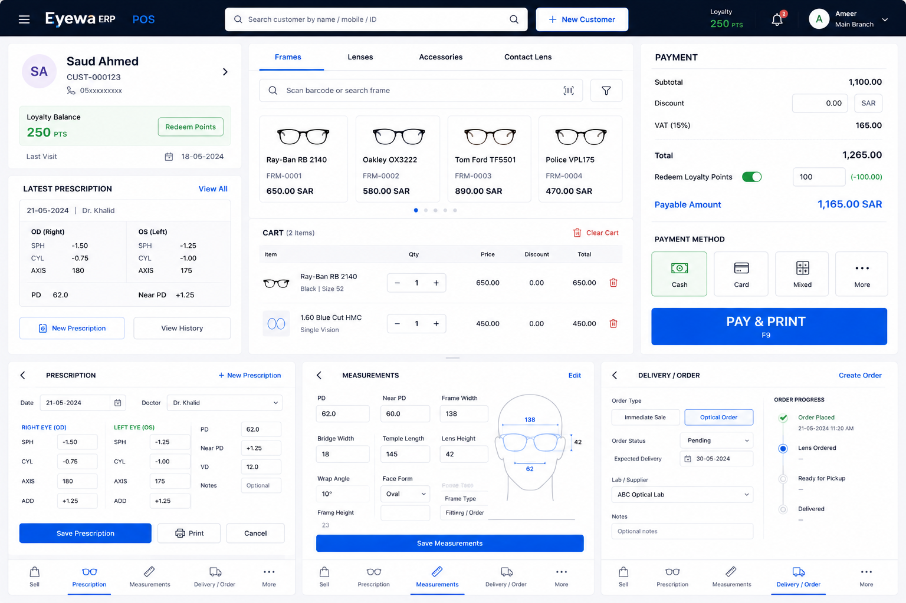

# Feature: Create customer

## Summary

Provide a **Create Customer** screen where store staff register a new customer and open a sales record. The screen is opened from **+ New Customer** in the POS header ([`002-common-components` app-header](../002-common-components/components/app-header/spec.md)).

Staff enter **customer name** and **mobile number** only. **Store** comes from the authenticated session (`AuthService.selectedStore()`); **invoice number** is always sent empty (API generates); **invoice date** is set automatically to today. On successful save, the app persists the customer in `CustomerSessionService`, selects them on the Sell tab, and navigates back.

The screen uses a **standalone full-page layout** (header and bottom nav hidden), matching the profile page pattern.

**Implementation plan:** [`plan.md`](./plan.md)

## Implementation status

| Phase | Scope | Status |
|-------|--------|--------|
| **1 — UI shell** | Route, form fields, back/cancel, shell chrome hide | **Done** |
| **2 — InsertSales API** | POST payload, response mapping, validation, save feedback | **Done** |
| **3 — Sell integration** | Session persistence, select customer on Sell, navigate back | **Done** |
| **4 — Search / lookup** | Header customer search API (`customersearchfilter`) | **Done** (header); duplicate mobile check | Planned |

**Current state:** `/home/createcustomer` renders `CreateCustomerFormComponent` with **Customer Name** and **Mobile No** only. Store is resolved from session (not shown in UI). Save calls `POST {apiUrl}/sales/InsertSales`. On success, `CustomerSessionService` stores the record, `SellSessionStore` selects the new customer, and the app returns to the active POS tab (default **Sell**). Header search can also find existing customers via `sales/customersearchfilter` ([`002` app-header](../002-common-components/components/app-header/spec.md)).

## Scope

| In scope | Out of scope |
|----------|--------------|
| Create Customer form (**name + mobile** visible) | Full customer profile / edit screen |
| Store from session (`selectedStore` / `user.storeId`) — not a form field | Customer photo / ID scan |
| Saudi + Indian mobile validation | Customer delete / merge |
| Save via `sales/InsertSales` | Self-service customer registration |
| `CustomerSessionService` — persist created customer in `sessionStorage` | Payment / cart on this screen |
| Sell tab integration after save | OTP verification for mobile |
| Entry from header **+ New Customer** | Store dropdown on this screen |
| Back / Cancel navigation to previous POS tab | Duplicate mobile API check (Phase 4) |
| Full-page layout (no shell chrome) | |

## Reference



Related: [`002-common-components` app-header](../002-common-components/components/app-header/spec.md) — **+ New Customer** button  
Related: [`005-sell-dashboard`](../005-sell-dashboard/spec.md) — customer profile card on Sell tab (Phase 3 integration)

---

## Screen layout

Standalone page (same chrome pattern as profile):

```
┌ ← Back ─────────────────────────────┐
│         Create Customer               │
├───────────────────────────────────────┤
│  Customer Name      [ ____________ ]  │
│  Mobile No          [ ____________ ]  │
│                     Saudi / India hint│
│                                       │
│  [ Cancel ]            [ Save       ] │
└───────────────────────────────────────┘
```

**Tablet:** form is centered (max ~720px); labels and inputs align in a horizontal row; action buttons align with the input column. Use canonical tablet rules from [`002-common-components`](../002-common-components/spec.md#responsive-breakpoints-canonical) (implementation: `≥768px` today; align to `600px + height` rule in follow-up).

| Region | Behavior |
|--------|----------|
| **Top bar** | Back button returns to `returnTo` tab (default **Sell**) |
| **Form** | Reactive form; **Save** disabled until valid |
| **Actions** | **Cancel** and **Save** side by side (equal width) |

Shell chrome (app header, bottom nav) is **hidden** on this route per `PosShellComponent.hideShellChrome`.

---

## Form fields

| Label | Control | Required | Notes |
|-------|---------|----------|-------|
| **Customer Name** | text | Yes | Trimmed; min 2 characters |
| **Mobile No** | tel (`inputmode="numeric"`) | Yes | Digits only; Saudi or Indian format (see validation) |

### Hidden / server-side fields (not shown in UI)

| Field | Source | Notes |
|-------|--------|-------|
| **Store** | `AuthService.selectedStore().storeId` or `user.storeId`; fallback first `FillStore` result | Sent as `storeId` string in payload |
| **Invoice No** | Always `""` | API generates invoice number in response |
| **Invoice Date** | `formatInvoiceDate()` — today | `d-M-yyyy` (e.g. `22-6-2026`) |
| **Login ID** | `AuthService.user().loginId` | Sent as string in payload |

### Mobile validation

Accepted patterns (digits only after normalization):

| Region | Examples |
|--------|----------|
| **Saudi** | `966512345678`, `0512345678`, `512345678` |
| **India** | `919876543210`, `09876543210`, `9876543210` |

Invalid mobile shows field-level error; **Save** stays disabled while form is invalid.

---

## Copy (exact strings)

| Element | Text |
|---------|------|
| Page title | Create Customer |
| Back | Back |
| Cancel button | Cancel |
| Save button | Save |
| Save in progress | Saving… |
| Name placeholder | Enter customer name |
| Mobile placeholder | 966512345678, 9876543210 |
| Mobile hint | Saudi: 966… or 05… · India: 91… or 10-digit mobile |
| Validation (empty) | Please enter customer name and mobile number. |
| Name required | Customer name is required. |
| Name min length | Customer name must be at least 2 characters. |
| Mobile required | Mobile number is required. |
| Mobile invalid | Enter a valid Saudi or Indian mobile (e.g. 966512345678, 0512345678, 9876543210, 919876543210). |
| Save success | Customer saved. Invoice {invoiceNo} |
| No store selected | Unable to save customer. No store selected. |
| Not authenticated | Unable to save customer. Please sign in again. |
| Generic save error | Unable to save customer. Please try again. |
| Network error | Unable to reach the server. Check your connection and try again. |

---

## Navigation

| Trigger | Result |
|---------|--------|
| Header **+ New Customer** | Navigate to `/home/createcustomer?returnTo={activeTab}` |
| **Back** / **Cancel** | Navigate to `/home/{returnTo}` (default `sell`) |
| **Save** (success) | Persist session → select customer on Sell → navigate to `/home/{returnTo}` |

---

## User stories

### Story 1 — Open create customer from header

**As a** store staff member on the POS  
**I want** to tap **+ New Customer** in the header  
**So that** I can register a new customer without leaving the POS flow

**Acceptance criteria**

- [x] `PosShellComponent.onNewCustomer()` navigates to `/home/createcustomer`
- [x] `returnTo` query param preserves active tab for Back navigation
- [x] App header and bottom nav are hidden on this route
- [x] Page shows title **Create Customer** and Back control

### Story 2 — Fill customer details

**As a** store staff member  
**I want** to enter customer name and mobile number  
**So that** I can create a customer record for today's sale

**Acceptance criteria**

- [x] Only **Customer Name** and **Mobile No** are visible in the form
- [x] Store resolved from session (not shown as dropdown)
- [x] Customer Name required; minimum 2 characters
- [x] Mobile No required; Saudi or Indian format validated
- [x] Mobile input strips non-digits; `inputmode="numeric"`
- [x] Field-level error messages on blur / submit
- [x] **Save** disabled while form invalid or saving

### Story 3 — Save customer via InsertSales API

**As a** store staff member  
**I want** to save the form  
**So that** a customer and sales record are created in Eyewa ERP

**Acceptance criteria**

- [x] Save calls `POST {apiUrl}/sales/InsertSales` with JSON payload
- [x] Payload includes `storeId`, `customerName`, `customerNo`, `loginId`, `invoiceNo: ""`, `invoiceDate` as strings
- [x] `loginId` from `AuthService.user().loginId`
- [x] `invoiceDate` formatted as `d-M-yyyy` (e.g. `22-6-2026`)
- [x] Success response maps `objresult[0]` (`ID`, `InvoiceNo`, `CustomerNo`, `CustomerName`, `Status`)
- [x] Invalid form shows validation error without API call
- [x] Network/server errors show safe user messages (no raw API errors)

### Story 4 — Return to POS after create

**As a** store staff member  
**I want** the new customer to appear on the Sell tab after save  
**So that** I can continue the sale immediately

**Acceptance criteria**

- [x] After save, `CustomerSessionService.saveFromCreate()` persists form + API response in `sessionStorage` (`eyewa_customer_session`)
- [x] `SellSessionStore.selectCreatedCustomer()` sets `selectedCustomer` from session
- [x] App navigates back to `returnTo` tab (default **Sell**) after successful save
- [x] Customer profile card shows name, mobile, and `invoiceNo` from API (falls back to `salesId` as id line)
- [x] `AuthService.logout()` clears customer session
- [x] `SellSessionStore` hydrates from session on init (no default mock customer when session exists)

---

## Phase 2 — InsertSales API integration (implemented)

### Save flow

```
User clicks Save
    → CreateCustomerFormComponent.onSave()
    → validate form (name + mobile)
    → resolve storeId from AuthService session
    → CustomerService.insertSales(payload)
        → POST {apiUrl}/sales/InsertSales
        → map objresult[0] → InsertSalesResult
    → CustomerSessionService.saveFromCreate(payload, result)
    → SellSessionStore.selectCreatedCustomer()
    → navigate to /home/{returnTo}
```

### API contract (Eyewa demo)

| Item | Value |
|------|--------|
| **Path** | `sales/InsertSales` |
| **Method** | `POST` |
| **Content-Type** | `application/json` |
| **Example URL** | `https://demo.api.eyewacloud.com/api/sales/InsertSales` |
| **Auth** | `Authorization: Bearer {token}` |

**Request payload:**

```json
{
  "storeId": "1",
  "customerName": "Ahmed",
  "customerNo": "9666123883",
  "loginId": "1",
  "invoiceNo": "",
  "invoiceDate": "22-6-2026"
}
```

**Success response** (`status: "200"`):

```json
{
  "status": "200",
  "message": "Success",
  "objresult": [
    {
      "Status": "Record Inserted Successfully.",
      "ID": 114057,
      "InvoiceNo": "2020-24062026-34668",
      "CustomerNo": "8019382407",
      "chkavail": null,
      "CustomerName": "test"
    }
  ],
  "qrcodeimg": null
}
```

Client maps `ID` → `id`, `InvoiceNo` → `invoiceNo`, `CustomerNo` → `customerNo`, `Status` → `status`, `CustomerName` → optional `customerName`.

**Legacy shape** (`objresult.table[]` with camelCase fields) — still parsed as fallback.

| Payload field | Source |
|---------------|--------|
| `storeId` | `AuthService.selectedStore().storeId` or `user.storeId` (string) |
| `customerName` | Form, trimmed |
| `customerNo` | Form mobile, digits only |
| `loginId` | `String(AuthService.user().loginId)` |
| `invoiceNo` | Always `""` |
| `invoiceDate` | `formatInvoiceDate()` — today, `d-M-yyyy` |

### Error handling (UI messages)

| Condition | User message |
|-----------|--------------|
| Empty required fields | Please enter customer name and mobile number. |
| No store in session | Unable to save customer. No store selected. |
| HTTP `status 0` | Unable to reach the server. Check your connection and try again. |
| Missing `id` in response | Unable to save customer. Please try again. |
| Other HTTP errors | Unable to save customer. Please try again. |
| Not authenticated | Unable to save customer. Please sign in again. |

### App settings

| Key | Dev (`appsettings.json`) | Prod (`appsettings.prod.json`) |
|-----|--------------------------|--------------------------------|
| `apiUrl` | `https://demo.api.eyewacloud.com/api` | same |
| `insertSalesPath` | `sales/InsertSales` | `Admin/InsertSales` |
| `customerSearchPath` | `sales/customersearchfilter` | `sales/customersearchfilter` |

Stores reuse `storesPath` from login spec (session store resolution only).

---

## Phase 3 — Customer session + Sell integration (implemented)

### CustomerSessionService

| Property | Value |
|----------|--------|
| **Storage key** | `eyewa_customer_session` (`sessionStorage`) |
| **Signals** | `currentCustomer()` — full record; `sellCustomer()` — mapped `Customer` for Sell card |
| **Save** | `saveFromCreate(payload, result)` after successful InsertSales |
| **Clear** | `clear()` on `AuthService.logout()` |

### CreatedCustomerSession fields

| Field | Source |
|-------|--------|
| `customerName`, `customerNo`, `storeId`, `loginId`, `invoiceDate` | InsertSales payload |
| `salesId`, `invoiceNo`, `recordStatus` | API `objresult[0]` (`ID`, `InvoiceNo`, `Status`) |
| `customerName` | API `CustomerName` when present, else form payload |
| `apiStatus`, `apiMessage` | API top-level `status` / `message` |
| `createdAt` | ISO timestamp at save time |

### Sell dashboard mapping

`CustomerSessionService.toSellCustomer()` maps session → Sell `Customer` model:

| Customer field | Session field |
|----------------|---------------|
| `id` | `String(salesId)` |
| `displayName` | `customerName` |
| `phone` / `phoneMasked` | `customerNo` |
| `invoiceNo` | `invoiceNo` |
| `salesId` | `salesId` |
| `lastVisit` | `invoiceDate` |
| `loyaltyPoints` | `0` (until loyalty API) |

Customer profile card displays `invoiceNo` when present, otherwise `id`.

---

## Phase 4 — Customer search (header — implemented)

Lookup existing customers from the POS header (not the create-customer form).

| Item | Value |
|------|--------|
| **Endpoint** | `GET {apiUrl}/sales/customersearchfilter?mobileNumber={query}` |
| **Config** | `customerSearchPath` |
| **Spec** | [`002` app-header](../002-common-components/components/app-header/spec.md) |
| **Service** | `CustomerSearchService` |
| **Select** | `customerSelected` → `SellSessionStore.selectCustomer()` |

**Success response** (`status: "200"`):

```json
{
  "status": "200",
  "message": "Success",
  "objresult": [
    {
      "ID": 114057,
      "InvoiceNo": "2020-24062026-34668",
      "CustomerNo": "8019382407",
      "CustomerName": "test",
      "chkavail": null
    }
  ]
}
```

Mapped to Sell `Customer` via `mapCustomerSearchRow()`.

**Remaining Phase 4:** duplicate mobile check before create (not implemented).

---

## Implementation files

| File | Role |
|------|------|
| `src/app/features/pos/customer/create-customer-form.component.*` | Form UI, validation, save, navigation |
| `src/app/features/pos/customer/models/customer-sales.models.ts` | Payload/response types, session builder, date formatter |
| `src/app/features/pos/customer/models/customer.validators.ts` | Saudi + Indian mobile validators |
| `src/app/features/pos/customer/services/customer.service.ts` | HTTP POST, response mapping |
| `src/app/features/pos/customer/services/customer-session.service.ts` | Post-save session persistence |
| `src/app/features/pos/sell/services/sell-session.store.ts` | `selectCreatedCustomer()`, hydrate from session |
| `src/app/features/pos/sell/customer-profile-card/*` | Shows `invoiceNo`, name, mobile |
| `src/app/features/auth/services/auth.service.ts` | Clears customer session on logout |
| `src/app/app.routes.ts` | Route `createcustomer` |
| `src/app/features/pos/shell/pos-shell.component.ts` | Navigation + hide chrome |
| `src/app/features/pos/customer/services/customer-search.service.ts` | Header customer lookup |
| `src/app/features/pos/customer/models/customer-search.models.ts` | Search validation + mapping |
| `src/config/appsettings.json` | `insertSalesPath`, `customerSearchPath` |

### Verification

```bash
cd optical-pos-angular-capacitor-ux
npm start
# Login: Canada / a1b2c3d4
# Click + New Customer in header
# Fill Customer Name + Mobile No (e.g. Ahmed / 966512345678)
# DevTools → Network → POST .../sales/InsertSales (Bearer token in headers)
# App returns to Sell tab; customer card shows name, mobile, invoice number
# Cancel or Back returns without saving
```

---

## Requirements

### Functional

- Create customer form with **name + mobile** only (store from session)
- Saudi + Indian mobile validation
- Invoice date auto-set server-side; invoice number always empty in request
- Save via live `InsertSales` API (no mock path)
- Persist created customer in `CustomerSessionService`; select on Sell tab after save
- Entry from header; back/cancel navigation with `returnTo`

### Visual / UI

- Full-page layout consistent with profile page top bar
- Form fields min height 44px; 16px font on inputs
- Tablet: horizontal label/input rows; centered card (~720px max)
- **Cancel** (secondary) + **Save** (primary) side by side
- Primary Save uses `--color-pos-accent`; disabled when invalid
- Field-level and banner error messages

### Non-functional

- Safe areas on iOS (top bar + bottom Save padding)
- Works on tablet and phone
- Unit tests for form, `CustomerService`, and `CustomerSessionService`

## Out of scope

- Customer edit / history screens
- Barcode scan for mobile number
- Duplicate mobile validation via API (Phase 4)
- Payment or line items on create screen

## Dependencies

- [`001-staff-login`](../001-staff-login/) — session, `loginId`, `FillStore` / `StoreService`
- [`002-common-components`](../002-common-components/) — **+ New Customer** header button
- [`005-sell-dashboard`](../005-sell-dashboard/) — customer profile card displays created customer

## Resolved decisions

| Question | Decision |
|----------|----------|
| After save: stay vs return? | **Auto-return** to `returnTo` tab after successful save |
| Mobile format validation? | **Saudi + Indian** patterns in `customer.validators.ts` |
| `invoiceNo` in form? | **Hidden** — always sent as `""`; API returns generated invoice |
| Sell card field mapping? | See Phase 3 mapping table (`salesId`, `invoiceNo`, `customerName`, `customerNo`) |
| Header search vs create? | Search selects existing customer on Sell; create still uses InsertSales |

## Open questions

- [ ] Should customer session survive browser refresh only (`sessionStorage`) or persist across app restarts (`localStorage`)?
